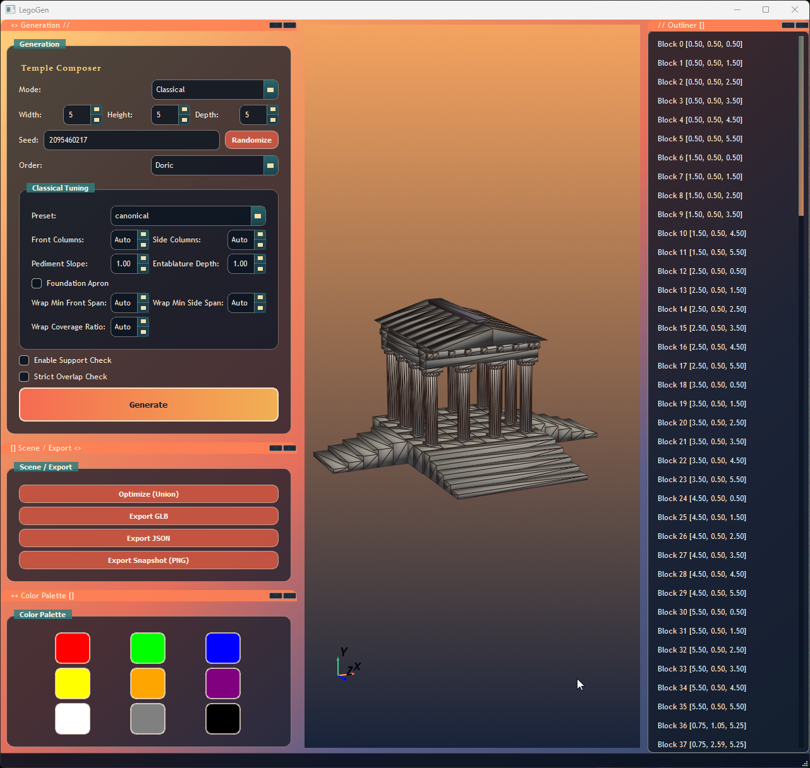
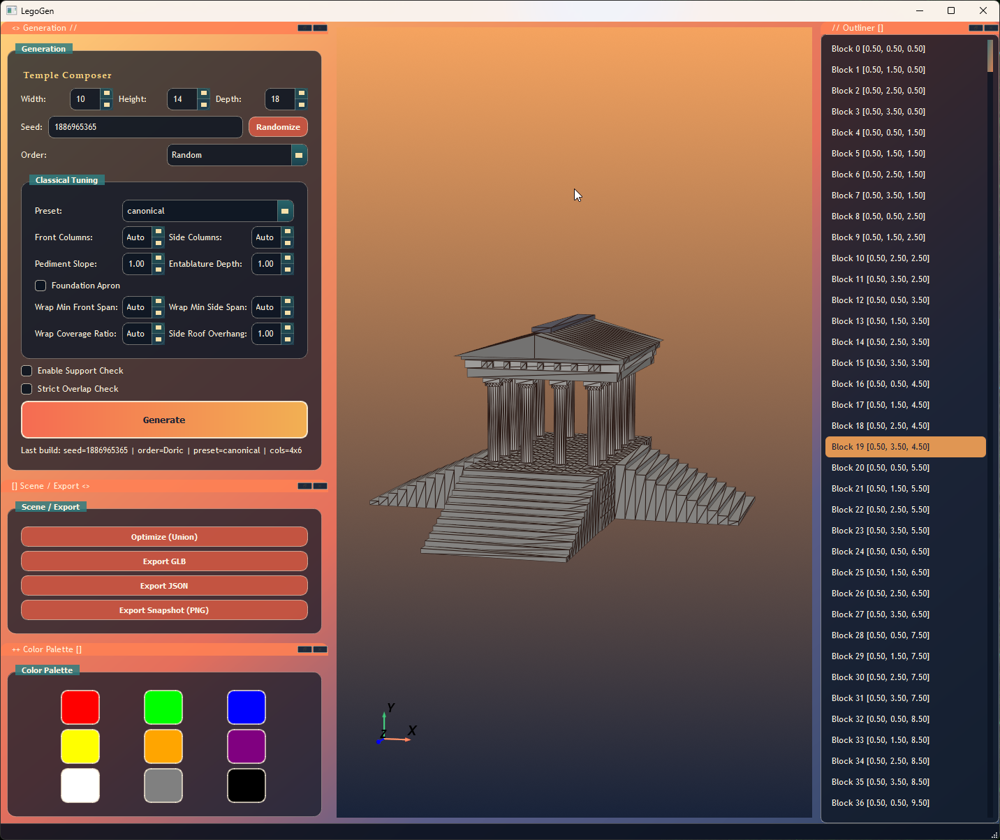
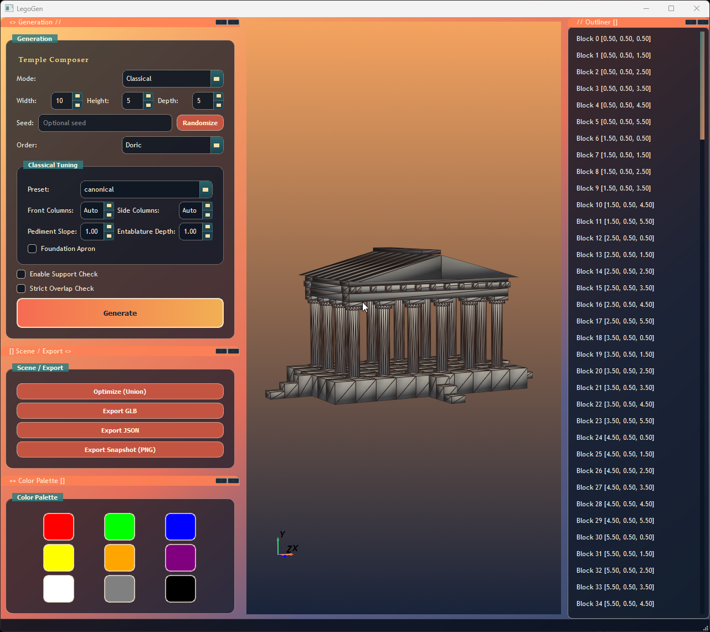
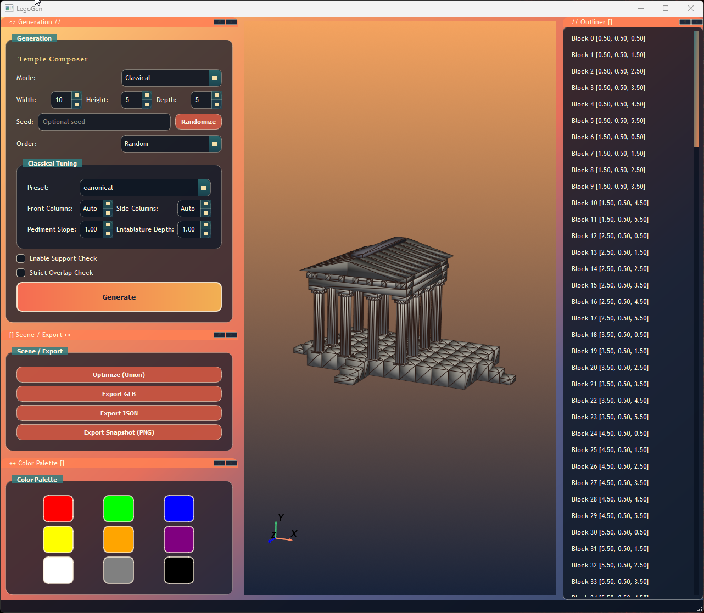

# LegoGen (Public Build)

This repository is the stripped, shareable production branch of LegoGen.
It keeps the stable classical generator, GUI viewer, and export pipeline, and excludes in-progress planning/session artifacts.

## Screenshots







## What Is Included

- PyQt5 + PyVista desktop GUI (`main.py`)
- Headless CLI generation/export (`cli.py`)
- Classical generator with preset/override controls
- GLB, JSON, and PNG export paths
- Unit tests for geometry, scene, and classical generation

## Quick Start

```bash
python3 -m venv .venv-public
source .venv-public/bin/activate  # Windows: .venv-public\Scripts\activate
pip install -r requirements.txt
cp .env.example .env
python3 main.py
```

## Environment Separation

Keep this repo independent from your development repo:

- Public repo venv: `.venv-public`
- Dev repo venv: use a different folder name (for example `.venv-dev`)
- Do not share `.env` files between the two repos

This avoids dependency and config drift between production and experimental work.

## CLI Examples

```bash
python3 cli.py generate --classical-order Doric --seed 123 --out builds/classical.glb --summary
python3 cli.py generate --classical-order Ionic --classical-preset monumental --classical-front-columns 8 --classical-side-columns 8 --classical-pediment-slope 1.1 --classical-entablature-depth 1.2 --classical-side-roof-overhang 1.25 --classical-foundation-apron --width 24 --depth 24 --summary
python3 cli.py generate --classical-order Doric --classical-preset canonical --classical-wrap-min-front-span 22 --classical-wrap-min-side-span 14 --classical-wrap-front-coverage 0.60 --width 20 --height 12 --depth 14 --summary
```

## Tests

```bash
python3 -m unittest tests.test_geometry -v
python3 -m unittest tests.test_scene -v
python3 -m unittest tests.test_classical_generator -v
python3 test_imports.py
```
